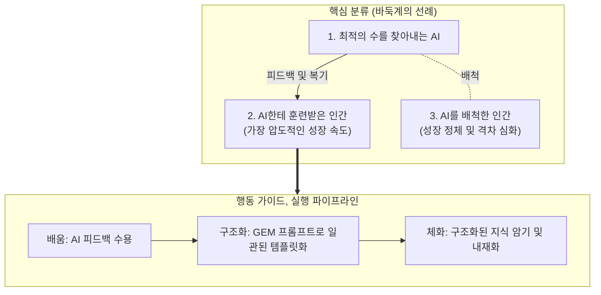

## 목표
* 바둑계에 먼저 닥쳤던 AI 혁명의 전개 방식을 이해하고 현재 내 상황에 대입하기
* 불확실한 미래 속에서 AI를 배척하지 않고 'AI에게 훈련받아 압도적으로 성장하는 인간' 포지션 구축하기
* GEM을 통해 산발적인 배움을 일관된 프레임워크로 구조화하고 머릿속에 암기하는 파이프라인 정립하기

## 기억하기
* 미래 사회를 구성하는 3대 계층:
  * 항상 최적의 수를 찾아내는 AI
  * AI의 피드백을 흡수하여 가장 빠르게 훈련받고 성장하는 인간
  * AI를 불신하거나 배척하여 격차가 벌어지는 인간
* 바둑계 판도를 바꾼 것은 AI 자체가 아니라, AI의 복기 시스템을 적극 활용해 기존 정석을 허문 기사들이라는 점
* 이해에서 끝나면 휘발되므로, 구조화된 핵심 뼈대는 반드시 외워서 뇌에 각인해야 한다는 사실

## 내용
* **바둑계 선례가 남긴 교훈**:
  * 알파고 충격 이후 바둑계는 기존 관습을 고집한 집단 대신, AI와 함께 복기하고 훈련한 신예들이 정상을 장악함
  * AI는 인간의 경쟁 상대가 아니라 상상을 초월하는 속도로 성장할 수 있게 돕는 '가장 정밀한 코치'임
* **오늘 취해야 할 행동 가이드**:
  * AI에게 지속해서 묻고 피드백을 받는 배움 루틴 형성
  * 입력된 비정형 데이터와 통찰을 시스템 프롬프트(GEM)를 통해 일관된 템플릿으로 정제
* **지식 내재화 메커니즘**:
  * 정리된 텍스트를 눈으로만 읽지 않고, 핵심 명제와 키워드를 선별하여 암기
  * 암기된 지식 프레임워크가 무의식적 직관과 의사결정 속도로 이어지도록 훈련

## 느낀점
* 과거 바둑 기사들이 마주했던 충격과 변화의 파도가 이제 모든 지식 산업 노동자에게 들이닥쳤음을 체감함
* AI를 단순 검색기가 아닌 '훈련 교관'으로 대우할 때 인간의 학습 곡선이 수직 상승할 수 있음을 깨달음
* 감상으로 흩어지기 쉬운 독서 기록을 GEM 구조화 시스템과 암기로 연결해야겠다는 실행 동기가 생김

## 결론
* AI한테 배움을 멈추지 않고 매일 훈련 파트너로 활용하기
* GEM을 구축하여 모든 학습 내용을 일관된 구조로 요약·정리하기
* 구조화된 핵심 로직을 완전히 암기하여 즉시 꺼내 쓸 수 있는 내 지식으로 체화하기

## 참고
* 도서: 『먼저 온 미래』
* 툴: Google Gemini (Gems), Markdown 기반 노트 시스템
* 예시 코드: 지식을 3단계로 구조화하고 암기용 요약 카드를 강제 출력하는 GEM 시스템 프롬프트 예시
```markdown
  # Role: 지식 구조화 및 암기 트레이너 GEM
  
  ## Instruction:
  * 사용자가 입력한 모든 비정형 텍스트를 아래 3대 규격으로만 분해하여 출력할 것.
  * 서론, 결론, 인사말 등의 군더더기는 일절 배제할 것.
  
  ## Output Template:
  * **[핵심 정의]**: 대상 개념을 직관적인 1문장으로 압축
  * **[작동 원리]**: 인과관계와 메커니즘을 3개 이내 글머리표로 정리
  * **[암기 키워드]**: 오늘 즉시 머릿속에 외워야 할 핵심 단어 3개 선정
```

## 요약 이미지

