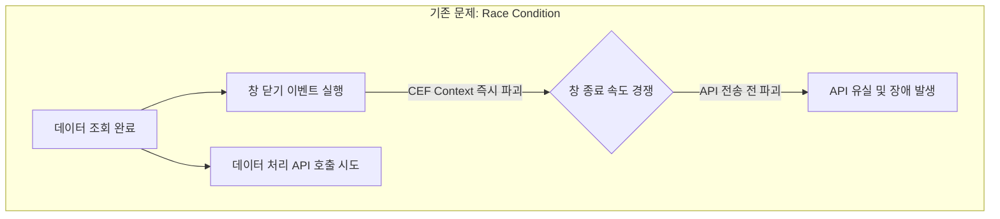
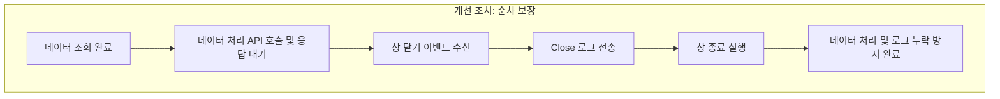

## 목표
* 신규 기능 배포 당일 발생한 데이터 처리 누락 장애 원인 규명
* CEF(Chromium Embedded Framework) 환경의 팝업 라이프사이클과 비동기 API 처리 한계점 파악
* 플랫폼 간 정합성 및 사용자 UX를 고려한 안전한 창 닫기 및 로깅 처리 구조 확립

## 기억하기
* CEF 환경에서 모달(창)을 닫으면 실행 중인 JS Context와 네트워크 I/O 파이프라인이 즉시 파기됨
* 비동기 작업(API, 로깅)과 렌더러 파괴 이벤트 사이의 Race Condition은 환경 속도에 따라 간헐적으로 발생하여 QA에서 놓치기 쉬움
* 프로세스 생명주기를 벗어나는 비동기 작업은 상위 컨텍스트 위임 또는 확실한 순서 보장(완료 후 닫기)이 필수적임

## 내용
* **장애 현상**
  * 배포 당일 대규모 트래픽이 몰리는 특정 상황에서 비동기 요청이 간헐적으로 유실되는 문제 발생
* **배경 및 구조 변경**
  * 기존 단일 API 세션 점유 시간(데이터 조회 + 처리) 과다 문제 해소 목적
  * 데이터 조회 API와 데이터 처리 API를 2단계로 분리
  * 사용자 대기 시간을 줄이기 위해 1단계 조회 완료 직후 모달을 닫고 백그라운드에서 2단계 처리 API를 실행하도록 UX 개선
* **QA 단계 미검출 원인**
  * 로컬/QA 환경에서는 비동기 요청 패킷이 전송된 후 창 닫기 파괴 루틴이 수행되어 정상 처리됨
  * 닫기 로직과 요청 처리 완료 간의 미세한 타이밍 차이에 의존하는 Race Condition 발생
* **근본 원인 분석**
  * 데스크톱 클라이언트(CEF) 환경의 특성상 창 닫기 이벤트 수신 시 브라우저 프로세스 및 JS Context가 즉각 종료됨
  * 대규모 데이터 처리나 네트워크 지연 시 API 발송 전 창이 닫혀 요청 자체가 유실됨
* **해결 및 의사결정 과정**
  * 1안(부모창 위임): 창이 닫혀도 유지되는 부모 컨텍스트로 API 호출을 이전하려 했으나, 레거시 시스템과의 스펙 일치 및 사용자 취소 의도 반영 요구로 철회
  * 최종 적용: 팝업 본창에서 데이터 처리 API 응답을 완전히 수신한 이후 창 닫기(Close)를 트리거하도록 순서 강제
  * 로깅 누락 보완: 닫기 버튼 클릭 시점의 이탈 로그 유실 방지를 위해 창 닫기 수신 이벤트 시점에 직접 close 이벤트를 전송하도록 보완

```typescript
// [수정 전 예시] 비동기 요청 시작 직후 닫아 Context 유실 발생
async function handleProcessDataWrong() {
  const data = await fetchData();
  // 창을 바로 닫아 CEF 렌더러가 파괴되면서 processData가 취소됨
  closeWindow();
  await processData(data);
}

// [수정 후 예시] API 완료 보장 후 창 닫기 및 종료 이벤트 처리
async function handleProcessDataFixed() {
  try {
    const data = await fetchData();
    // 1. 데이터 처리 요청 완료를 반드시 대기
    await processData(data);
  } catch (error) {
    console.error("처리 실패", error);
  } finally {
    // 2. 네트워크 및 로그 전송 보장 후 창 종료 트리거
    sendLoggingEvent('MODAL_CLOSE');
    closeWindow();
  }
}
```

## 느낀점
* 데스크톱 CEF 환경은 일반 브라우저 탭과 달리 창 종료 시 렌더러와 네트워크 스레드가 즉시 소멸하므로 생명주기 관리에 각별히 유의해야 함을 느낌
* 실행 환경의 네트워크 속도나 기기 성능에 따라 결과가 달라지는 Race Condition은 로컬이나 단일 QA 테스트만으로 신뢰성을 완벽히 보장하기 어렵다는 점을 체감함
* 기존 레거시 시스템과의 동작 일치와 기획적 예외 처리(사용자의 빠른 닫기 시 처리 취소 의도 등)를 고려한 조율 과정이 기술적 해결책만큼 중요하다는 점을 느낌

## 결론
* 긴 호흡의 비동기 작업을 수반하는 팝업 모달은 작업 완료 전까지 컨텍스트 파괴를 지연시키는 것이 필수적임
* 본창에서 비동기 데이터 처리 API 호출 완료를 보장한 후 창을 닫도록 변경하여 데이터 유실 문제를 원천 차단함
* 창 닫기 이벤트 트리거 내에 로깅 이벤트를 묶어 비정상적인 로그 유실 문제를 완전히 해결함

## 참고
* CEF Window Lifecycle & CefLifeSpanHandler Close Execution
* Chromium Renderer Process Teardown & In-flight Network Request Cancellation
* W3C Page Lifecycle API & Beacon Pattern Limitations

## 요약 이미지





