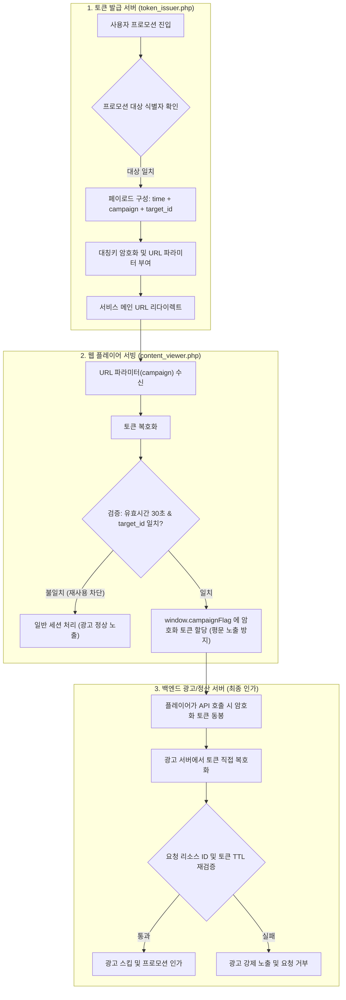

## 목표
* 특정 대상(채널/콘텐츠) 전용 캠페인 토큰의 타 리소스 무단 재사용(Replay/Reuse Attack) 취약점 차단
* 개발자 도구(F12) 및 프록시 툴을 이용한 클라이언트 사이드 변수 조작(Client-side Tampering) 공격 원천 방어
* 토큰 검증 권한을 신뢰할 수 없는 프론트엔드에서 격리하고 백엔드 서비스(광고/정산 서버)로 일원화

## 기억하기
* 유효시간(TTL) 검증만으로는 토큰의 도난 및 인가되지 않은 다른 대상 리소스로의 전용(Replay)을 막을 수 없음
* 토큰 생성 시 반드시 [발급 시간 + 캠페인 목적 + 대상 식별자(Target ID)]를 단일 페이로드로 묶어 암호화(Binding)할 것
* 브라우저(클라이언트) 환경은 전적으로 신뢰할 수 없는 영역이므로, 권한 플래그를 평문으로 노출하지 말고 암호화 토큰 릴레이 역할만 맡길 것

## 내용
* **기존 취약점 원인 분석**:
  * 토큰 발급 시 페이로드가 `time() . '|campaign_name'` 형태로만 구성되어 어느 리소스(채널/크리에이터)를 대상으로 발급되었는지 식별 불가
  * 정상 발급된 토큰을 가로채 30초 유효시간 내 다른 타깃 URL 파라미터(`campaign=TOKEN`)로 접속 시 검증을 통과하여 비인가 혜택(광고 스킵 등) 획득 가능
  * 웹 페이지 렌더링 시 브라우저 전역 변수에 `window.campaignType = 'event_pass'`와 같이 평문 플래그를 주입하여 콘솔 조작만으로 우회 가능
* **개선 1: 발급 대상 리소스 ID 페이로드 바인딩 (`token_issuer.php`)**:
  * 암호화 페이로드에 허가 대상 고유 식별자(`$targetId`)를 추가하여 특정 리소스에만 종속되도록 수정
  ```diff
      // 프로모션 대상 크리에이터인 경우 혜택 토큰 파라미터 발급
      if (in_array($targetId, $authorizedTargetList)) {
  -       // 생성 시간 + 캠페인 식별자만 암호화 (대상 식별자 누락 취약점 존재)
  -       $payload = time() . '|event_pass';
  +       // 생성 시간 + 캠페인 식별자 + 인가 대상 ID를 결합하여 암호화 (리플레이 어뷰징 방지)
  +       $payload = time() . '|event_pass|' . $targetId;
          $encryptedToken = urlencode(custom_encrypt($payload, SECRET_KEY));
          $redirectUrl .= (strpos($redirectUrl, '?') === false ? '?' : '&') . 'campaign=' . $encryptedToken;
      }
  ```
* **개선 2: 접근 대상 리소스와 토큰 식별자 일치 검증 (`content_viewer.php`)**:
  * 복호화된 페이로드의 대상 식별자(`$targetId`)와 사용자가 실제 진입하려는 리소스 식별자가 일치하는지 대조 검증
  ```diff
      if (!empty($decryptedPayload)) {
          $tokenData = explode('|', $decryptedPayload);
  -       // 기존: 시간 및 캠페인명만 검증
  -       if (count($tokenData) === 2 && $tokenData[1] === 'event_pass') {
  +       // 개선: 시간, 캠페인명 및 현재 진입 대상 식별자 일치 여부까지 검증
  +       if (count($tokenData) === 3 && $tokenData[1] === 'event_pass' && $tokenData[2] === $targetId) {
              $issuedTime = (int)$tokenData[0];
              // 30초 이내에 발급된 토큰인지 검증
  ```
* **개선 3: 클라이언트 평문 노출 차단 및 암호화 토큰 릴레이 (`content_viewer.php`)**:
  * 브라우저 메모리에 평문 플래그 대신 암호화된 토큰 자체를 전달하여 위변조 방어
  ```diff
              // 유효 시간 검증 통과 시
              if (time() - $issuedTime <= 30) {
  -               $campaignFlag = 'event_pass'; // 클라이언트 평문 노출
  +               // 암호화된 토큰 해시 자체를 주입하여 변조를 방지하고 서버 간 재검증 유도
  +               $campaignFlag = $_REQUEST['campaign'];
              }
  ```
* **백엔드(광고/정산 서버) 추가 연동 규격**:
  * 클라이언트가 API 호출 시 암호화 토큰을 그대로 페이로드에 담아 전송
  * 백엔드 API에서 토큰을 직접 복호화하여 (1) 대상 리소스 ID 일치 여부 (2) 만료 시간(TTL)을 최종 재검증 후 혜택 인가

## 느낀점
* 유효시간 만료(TTL) 설정만으로는 리소스 탈취 후 타깃을 바꿔치기하는 리플레이 공격을 완벽히 차단할 수 없음을 배움
* "클라이언트는 언제든 변조될 수 있다"는 제로 트러스트(Zero Trust) 관점을 시스템 설계에 적용해야 함의 중요성을 체감함
* 코드 리뷰 과정에서 누락된 식별자 바인딩 문제를 사전에 발견해 실서비스 배포 전 보안 사고를 예방할 수 있었음

## 결론
* 암호화 토큰 설계 시 필수 메타데이터인 생성 시간(Timestamp), 인가 범위(Scope), 인가 대상(Target Resource)을 모두 페이로드에 바인딩해야 함
* 브라우저는 단순히 토큰을 전달하는 중계자로만 두고, 최종 인가 및 복호화 권한은 백엔드 서비스가 독점하도록 아키텍처를 구성해야 안전함

## 참고
* OWASP Top 10 - Broken Access Control
* RFC 7519: JSON Web Token (JWT) Claim Design Principles
* Defensive Programming: Zero Trust Client Architecture

## 요약 이미지

