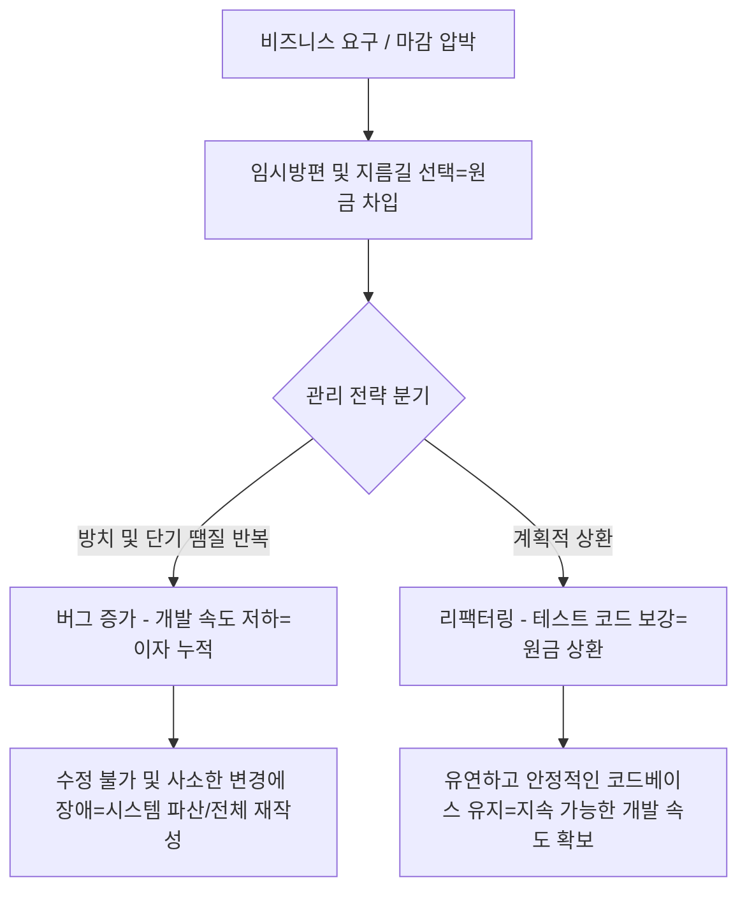

## 목표
* 빠른 출시를 위해 품질을 희생할 때 발생하는 기술 부채의 본질 파악하기
* 금융 부채(원금·이자·파산)와 기술 부채 간의 대응 메커니즘 이해하기
* 기술 부채를 유발하는 4대 주요 원인을 식별하고 예방 방안 정리하기
* '의도적 차입'과 '계획적 상환' 프로세스를 통해 지속 가능한 코드베이스 구축하기

## 기억하기
* **개념 정의**: 빠른 개발을 위해 품질과 설계를 양보(지름길 선택)하여 이후 추가 작업과 비용으로 갚아야 하는 잠재적 대가
* **원금 (Principal)**: 일정 단축을 위해 건너뛴 작업 (리팩터링, 단위 테스트 작성, 아키텍처 설계 등)
* **이자 (Interest)**: 부채로 인해 매 작업마다 지속적으로 발생하는 추가 비용 (버그 수정 지연, 신규 기능 추가 속도 저하)
* **파산 (Bankruptcy)**: 스파게티 코드가 한계에 도달해 사소한 변경에도 장애가 터져 전체 재작성이 불가피한 상태
* **활용 원칙**: 무조건 피해야 할 악이 아니며, 빠른 비즈니스 검증을 위해 '의도적으로 빌려 쓰고 계획적으로 갚는 것'이 핵심

## 내용
* **기술 부채의 금융 비유 메커니즘**
  * 금융에서 대출을 받아 사업을 키우듯 임시 패치나 하드코딩으로 출시를 앞당길 수 있음
  * 갚지 않은 대출에 이자가 누적되듯 정돈되지 않은 코드는 매 스프린트마다 추가 작업 공수를 유발함
  * 부채가 통제 범위를 넘어서면 유지보수 불능(파산)에 빠져 시스템 전체 재작성이 요구됨

* **기술 부채가 발생하는 4가지 주요 원인**
  * **일정 압박**: 데드라인 준수를 위해 확장성 고려나 모듈 분리, 리팩터링을 뒤로 미룸
  * **비즈니스 요구 변화**: 초기 설계 당시엔 최선이었으나 기능이 누적되며 기존 아키텍처가 한계에 봉착
  * **테스트 및 문서화 부재**: 레거시 동작 파악이 어렵고 회귀 버그(Regression) 공포로 인해 코드를 수정하지 못함
  * **단기 땜질식 대응**: 근본 원인 해결 대신 임시 플래그 변수나 if-else 분기문만 덕지덕지 추가

* **코드 예시: 기술 부채 발생과 상환**
  * **부채가 쌓이는 코드 (하드코딩 및 flag 땜질 분기)**
    ```typescript
    // 마감 직전: 임시 플래그와 분기문으로 급조 (이자 발생 시작)
    function calculateDiscount(price: number, type: string, isVip: boolean): number {
      if (type === 'CARD') {
        return price * 0.95;
      } else if (type === 'PAY') {
        if (isVip) return price * 0.85; // 임시 이벤트 조건 누적
        return price * 0.9;
      } else if (type === 'CASH') {
        return price * 0.98;
      }
      return price; // 새로운 결제 수단 추가 시 복잡도 급증
    }
    ```
  * **부채를 상환한 코드 (전략 패턴 적용 및 확장성 확보)**
    ```typescript
    // 원금 상환: 역할 분리와 테이블 기반 확장 구조로 리팩터링
    interface DiscountStrategy {
      apply(price: number, isVip: boolean): number;
    }

    const discountStrategies: Record<string, DiscountStrategy> = {
      CARD: { apply: (price) => price * 0.95 },
      PAY: { apply: (price, isVip) => (isVip ? price * 0.85 : price * 0.9) },
      CASH: { apply: (price) => price * 0.98 },
    };

    function calculateDiscount(price: number, type: string, isVip: boolean = false): number {
      const strategy = discountStrategies[type];
      return strategy ? strategy.apply(price, isVip) : price;
    }
    ```

## 느낀점
* "나중에 고쳐야지" 하고 남겨둔 임시 코드는 높은 확률로 방치되어 팀 전체의 생산성을 갉아먹는 이자로 변함을 실감함
* 완벽주의로 출시를 늦추기보다 비즈니스 검증을 위해 의도적으로 빚을 지되, 상환 계획(백로그 티켓화)을 세우는 태도가 중요함
* 최소한의 자동화 테스트가 갖춰져 있어야 추후 두려움 없이 안전하게 원금을 상환(리팩터링)할 수 있음을 깨달음

## 결론
* 기술 부채는 시장 선점을 위해 활용할 수 있는 전략적 레버리지이지만, 방치 시 시스템 파산을 초래함
* 부채의 존재를 팀 내에 투명하게 가시화하고 스프린트마다 일정 비율의 상환 공수를 공식 배정해야 함
* 지속적인 단위 테스트 보강과 점진적 리팩터링이 기술 부채의 이자 폭탄을 막는 가장 확실한 관리법임

## 참고
* 워드 커닝햄(Ward Cunningham)의 1992년 OOPSLA 보고서 (기술 부채 개념 최초 제안)
* 마틴 파울러(Martin Fowler)의 기술 부채 사분면 (Technical Debt Quadrant)
* 로버트 C. 마틴 저서 《클린 코드(Clean Code)》

## 요약 이미지
* **Mermaid 다이어그램으로 매핑한 기술 부채 라이프사이클**

